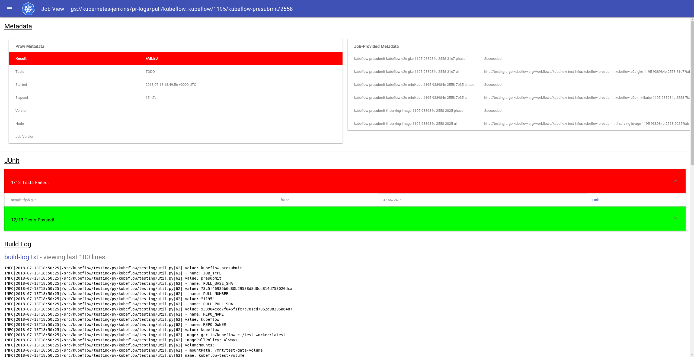

# Spyglass
A spyglass is an lensed monocular maritime instrument used to see things that may have been
difficult to see otherwise.

Spyglass is a pluggable artifact viewer framework for [Prow](..) and a crude
metaphor for the real object. It collects artifacts (usually files in a storage
bucket) from various sources and distributes them to registered viewers, which
are responsible for consuming them and rendering a view.

A typical Spyglass page might look something like this:


A general Spyglass query will proceed as follows:
- User provides a job source in the query (usually a job name and build ID).
- Spyglass performs a `list` call on the source and finds all artifact names
  associated with that job source.
- Spyglass builds a cache of which artifacts match which viewers via
  configured regular expressions.
- Viewers with matching artifacts are pre-rendered in order of descending
  priority.
- Spyglass then sends render requests to each registered viewer with its
  matching artifacts.
- Each viewer performs any necessary operations on the artifacts and produces
  a blob of HTML.
- Views (HTML) are inserted asynchronously as viewers return.


## Viewers
A viewer is a function that consumes a list of artifacts and produces some
HTML.

Viewer names are unique and are stored in registries that map the name
to a handler function and some metadata about the viewer.


### Built-in Viewers
Spyglass comes with some built-in viewers for commonly produced artifacts.

- Prow Metadata  
  ```
  Name: MetadataViewer
  Title: Metadata
  Match: finished.json|started.json
  Priority: 0
  ```
- JUnit  
  ```
  Name: JUnitViewer
  Title: JUnit
  Matches: artifacts/junit.*\.xml
  Priority: 5
  ```
- Logs  
  ```
  Name: BuildLogViewer
  Title: Build Log
  Matches: build-log.txt|pod-log
  Priority: 10
  ```

### Building your own viewer
Building a viewer consists of three main steps.

#### Write Boilerplate
First, create a package `viewernamehere` under `prow/spyglass/viewers`, create a
`go` file and import the `viewers` package like so:
```go
import "k8s.io/test-infra/prow/spyglass/viewers"
```

#### Implement
Next, implement the necessary functions for a viewer. More specifically,
implement the following function signature:
```go
type ViewHandler func([]Artifact, string) string
```

Create an `init` method, call `viewers.RegisterViewer()` with the appropriate
metadata (required: `Name`, `Title`, `Priority`) and your implementation of `ViewHandler`.
Spyglass should now be aware of your viewer.

#### Add to config
Finally, decide which artifacts you want your viewer to consume and create a regex that
matches these artifacts. The JUnit viewer, for example, consumes all
artifacts that match `artifacts/junit.*\.xml`.

Add a line in `prow` config under the `viewers` section of `spyglass` of the following form:
```yaml
"myartifactregexp": ["myviewname"]
```

The next time a job is viewed that contains artifacts matched by your regexp,
your view should display.

See the [GoDoc](https://godoc.org/k8s.io/test-infra/prow/spyglass/viewers) for
more details and examples.

## Config
Spyglass config takes the following form:
```yaml
deck:
  spyglass:
    viewers:
      "started.json|finished.json": ["MetadataViewer"]
      "build-log.txt": ["BuildLogViewer"]
      "artifacts/junit.*\\.xml": ["JUnitViewer"]
```

More formally, it is a single `spyglass` object under the top-level `deck`
object that contains a field `viewers`. `viewers` is a map of `string->[]string`
where the key must be a [valid golang regular
expression](https://github.com/google/re2/wiki/Syntax) and the value is a list
of viewer names that consume the artifacts matched by the corresponding regular
expression.


